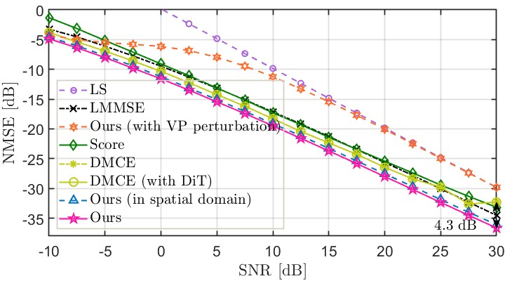
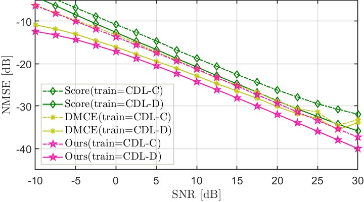
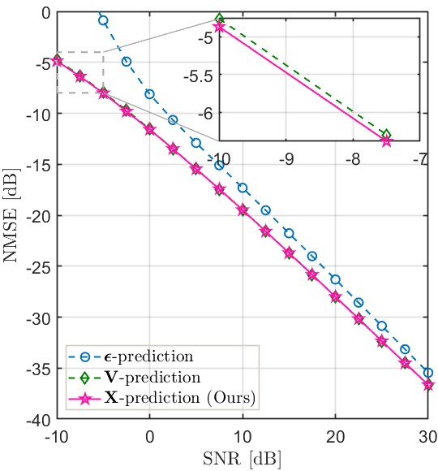
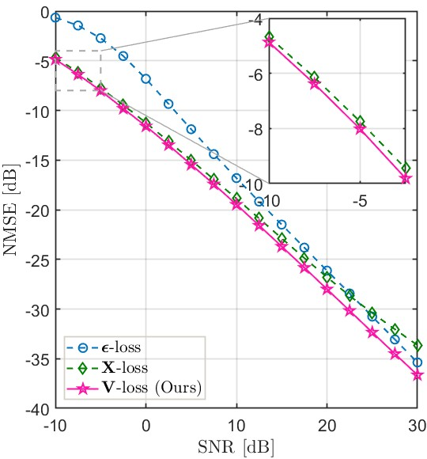

# 🚀 Sampling-Free Diffusion Transformers for Low-Complexity MIMO Channel Estimation

[](https://arxiv.org/abs/2602.02202)
[](https://www.python.org/downloads/)
[](https://pytorch.org/get-started/locally/)

***Zhixiong Chen, Hyundong Shin, Arumugam Nallanathan***

***Queen Mary University of London***

⭐ **If you find SF-DiT-CE helpful, please consider giving this repository a star. Thank you!** 🤗

---

## 📝  Abstract

Diffusion model-based channel estimators have demonstrated impressive performance, but they often suffer from high computational complexity due to their reliance on iterative reverse sampling. In this paper, we propose a sampling-free diffusion transformer (DiT)-based channel estimator, termed **SF-DiT-CE**, for low-complexity MIMO channel estimation. By exploiting the angular-domain sparsity of MIMO channels, we train a lightweight DiT to directly predict the true channels from their perturbed observations and corresponding noise levels.
During inference, we first obtain an initial channel estimate using the least-squares (LS) method, which can be interpreted as the true channel corrupted by Gaussian noise. The DiT then takes this estimate and its corresponding noise scale as inputs and recovers the channel in a single forward pass, thereby eliminating iterative sampling. Numerical results demonstrate that the proposed method achieves superior estimation accuracy and robustness while significantly reducing computational complexity compared with state-of-the-art baselines.

---

## 📊 Main Results

* Comparison of different channel estimators on the CDL-C dataset

[](https://imgsli.com/MzkzNjU5)

* Comparison of diffusion-based channel estimators on the CDL-D dataset

[](https://imgsli.com/MzkzNjU5)

* Impact of the prediction objective and loss function on NMSE

[](https://imgsli.com/MzkzNjU5)
[](https://imgsli.com/MzkzNjY5)

---

## 🛠️ Preparation

### 1. Install the environment

```bash
conda create -n SFDiTCE python=3.12
conda activate SFDiTCE
pip install -r requirements.txt
```

### 2. Download datasets and pretrained checkpoints from [here](https://drive.google.com/drive/folders/10wZHkuYvWO1cA1WCrLpPkgZcyGYrO2HH).

---

## ⚡ Inference for MIMO Channel Estimation

### Step 1. Place the dataset files under `/Channel_datasets`

### Step 2. Place `VE_checkpoint` under `/VE_DiT`

### Step 3. Run the evaluation script

```bash
python VE_DiT/eval.py \
    --is_angular=True \
    --predict_obj='X_predict' \
    --loss_type='V_loss'
```

### Variants of SF-DiT-CE

To evaluate different variants of SF-DiT-CE, modify the parameter settings as follows:


| Variant                        | is_angular | predict_obj       | loss_type      |
| ------------------------------ | ---------- | ----------------- | -------------- |
| Ours                           | True       | 'X_predict'       | 'V_loss'       |
| Ours (in spatial domain)       | False      | 'X_predict'       | 'V_loss'       |
| $\mathbf{V}$-prediction        | True       | 'V_predict'       | -              |
| $\mathbf{\epsilon}$-prediction | True       | 'epsilon_predict' | -              |
| $\mathbf{X}$-loss              | True       | 'X_predict'       | 'X_loss'       |
| $\mathbf{\epsilon}$-loss       | True       | 'X_predict'       | 'epsilon_loss' |


### Evaluate SF-DiT-CE with VP perturbation

To evaluate **SF-DiT-CE with VP perturbation** ("Ours with VP perturbation"):

1. Place `VP_checkpoint` under `/VP_DiT`
2. Run:

```bash
python VP_DiT/eval_VP_DiT.py
```

---

## 🔥 Training

### Train the VE version of SF-DiT-CE

```bash
python VE_DiT/train_VE_DiT.py \
    --is_angular=True \
    --predict_obj='X_predict' \
    --loss_type='V_loss'
```

You can modify these parameters to obtain different variants of SF-DiT-CE.

### Train the VP version of SF-DiT-CE

```bash
python VP_DiT/train_VP_DiT.py \
    --is_angular=True \
    --predict_obj='X_predict' \
    --loss_type='V_loss'
```

You may also adjust other parameters to obtain additional variants of SF-DiT-CE.

---

## 🔄 Training and Inference for Other Diffusion Models (Optional)

### Run the Score model on our dataset

Please refer to the [score-based-channels code](https://github.com/utcsilab/score-based-channels). You can use our dataset and pretrained checkpoints in `score_checkpoints`.

### Run DMCE on our dataset

Please refer to the [DMCE code](https://github.com/benediktfesl/Diffusion_channel_est). You can use our dataset and pretrained checkpoints in `DMCE_checkpoints`.

For DMCE, we provide training and evaluation scripts. Please follow the steps below:

1. Place the dataset files under `/Channel_datasets`
2. Place `DMCE_checkpoints` under `/Run_DMCE`
3. Download the DMCE code and copy the `DMME` and `modules` directories into `Run_DMCE`

Then run:

- `eval_DMCE.py` to evaluate DMCE
- `eval_DMCE_with_DiT.py` to evaluate DMCE with DiT
- `train_DMCE.py` to train DMCE
- `train_DMCE_with_DiT.py` to train DMCE with DiT

---

## 📚 Citation

If you find our work inspiring, please consider citing:

```bibtex
@article{chen2026sampling,
  title={Sampling-Free Diffusion Transformers for Low-Complexity MIMO Channel Estimation},
  author={Chen, Zhixiong and Shin, Hyundong and Nallanathan, Arumugam},
  journal={arXiv preprint arXiv:2602.02202},
  year={2026}
}
```
---
## Notes:

Before adding noise, the channel data are globally normalized by separately normalizing the real and imaginary parts using the training-set statistics. Hence, the average complex channel power in the normalized domain is approximately 2. 
For the defined SNR in the code (the actual SNR), we set $\gamma= 10^{(-SNR/10)}$ and generate complex noise as $\mathbf{N} = \sqrt{\gamma} (\mathbf{N}_R + j \mathbf{N}_I)$, where $\mathbf{N}_R$ and $\mathbf{N}_I$ are independent standard Gaussian random variables. 
Therefore, $\gamma$ denotes the per-real-dimension noise variance, while the complex noise power is $\mathbb{E}[|\mathbf{N}|^2] = 2\gamma$.
Since the pilot matrix and angular-domain transform are unitary, the effective SNR is approximately $\frac{2}{2\gamma} = 10^{(SNR/10)}$, which matches the actual SNR.

---

## 🙏 Acknowledgement

This work is implemented based on [JiT](https://github.com/LTH14/JiT?tab=readme-ov-file) and [score-based-channels](https://github.com/utcsilab/score-based-channels). We sincerely thank the authors for their excellent work.
